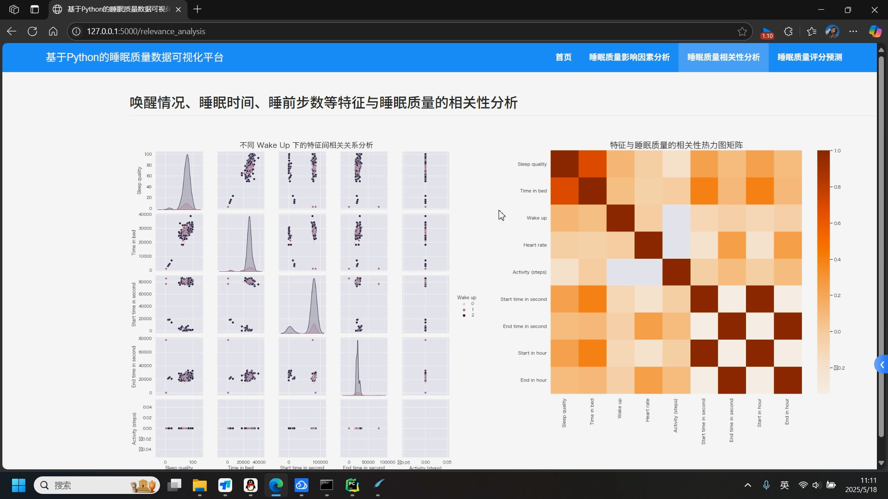

## 计算机毕业设计Python睡眠质量分析预测 睡眠质量可视化 大数据毕业设计(源码+LW文档+PPT+讲解视频) 机器学习 大数据毕业设计 数据仓库 大数据毕业设计 文本分类 LSTM情感分析 大数据毕业设计 知识图谱 大数据毕业设计 预测系统 实时计算 离线计算 数据仓库 人工智能 神经网络

## 要求
### 源码有偿！一套(论文 PPT 源码+sql脚本+教程)

### 
### 加好友前帮忙start一下，并备注github有偿睡眠25
### 我的QQ号是3575354124 或者798059319或者 1679232425或者微信:bysj1698

# 

### 加qq好友说明（被部分 网友整得心力交瘁）：
    1.加好友务必按照格式备注
    2.避免浪费各自的时间！
    3.当“客服”不容易，repo 主是体面人，不爆粗，性格好，文明人。

## 演示视频

https://www.bilibili.com/video/BV1JPJgzFEir/?spm_id_from=333.1387.homepage.video_card.click

## 介绍：
     Sleep Cycle（SC；NorthCube，Gothenburg，Sweden）是一款可在基于android和iOS设备上使用的移动电话应用程序。SC是一个智能闹钟，它可以跟踪你的睡眠模式，并在浅睡眠中唤醒你。SC会跟踪整晚的睡眠情况，并使用30分钟的窗口，在这个窗口中，警报会在最轻的阶段（即浅睡眠）结束，达到所需的警报时间。SC通过两种运动检测模式中的一种来进行睡眠运动检测：（i）使用内置麦克风分析运动的麦克风，或（ii）使用手机内置加速计的加速计。
## 开发技术：
    本项目利用 pandas + Matplotlib + seaborn + sklearn 等工具包，对睡眠数据进行探索式可视化分析，并构建 KNN、LR、决策树、随机森林等算法实现对睡眠质量的预测建模。

